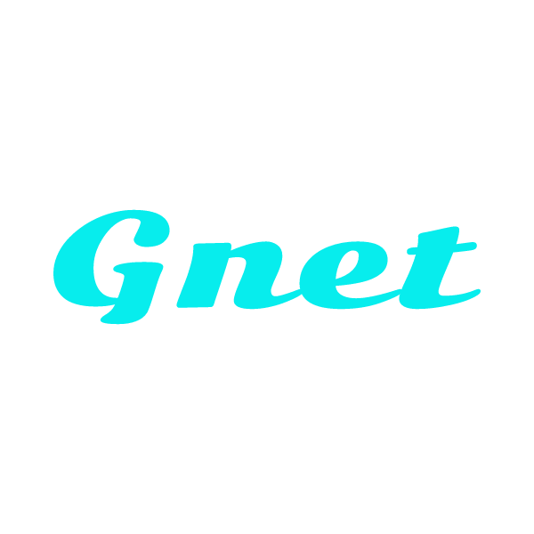
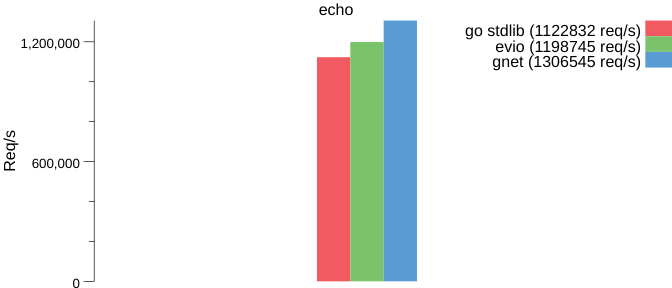
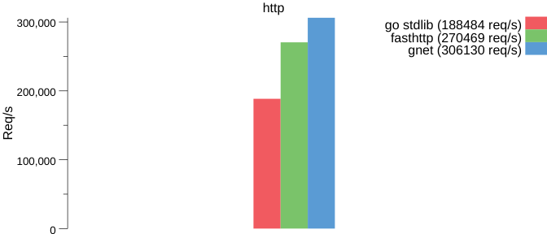
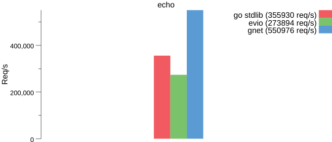
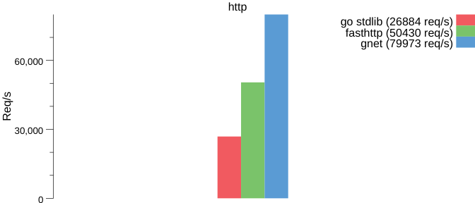

<p align="center">

</p>

`gnet` is an event-loop networking framework that is fast and small. It makes direct [epoll](https://en.wikipedia.org/wiki/Epoll) and [kqueue](https://en.wikipedia.org/wiki/Kqueue) syscalls rather than using the standard Go [net](https://golang.org/pkg/net/) package, and works in a similar manner as [libuv](https://github.com/libuv/libuv) and [libevent](https://github.com/libevent/libevent).

The goal of this project is to create a server framework for Go that performs on par with [Redis](http://redis.io) and [Haproxy](http://www.haproxy.org) for packet handling.

`gnet` sells itself as a high-performance, lightweight, nonblocking network library written in pure Go.

`gent` is derived from project `evio` while having higher performance.

> gnet is still under active development, so if you are interested in gnet, please feel free to make your code contributions to it ~~

# Benchmark Test

## On Linux (epoll)

### Test Environment

```powershell
Machine: Amazon c5.2xlarge
OS:      Ubuntu 18.04
CPU:     8 Virtual CPUs
Memory:  16.0 GiB
```


### Echo Server



### HTTP Server



## On MacOS (kqueue)

### Test Environment

```powershell
Machine: MacBook Pro
OS:      macOS Mojave 10.14.6
CPU:     4 CPUs
Memory:  8.0 GiB
```


### Echo Server



### HTTP Server

